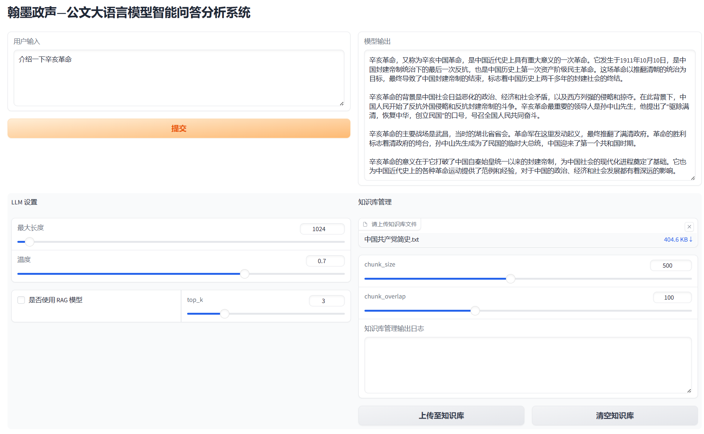

# 翰墨政声-公文大语言模型智能问答分析系统

## 使用方法

1. 下载模型
```bash
# 7B 模型
git clone -b 7B https://code.openxlab.org.cn/SHULPT/SCDM.git

# 20B 模型
git clone -b 20B https://code.openxlab.org.cn/SHULPT/SCDM.git
```

2. LMDeploy 部署 LLM 类 OPENAI 服务
```bash
lmdeploy serve api_server {path/to/model} --server-port 23333
```

3. 运行 demo.py
```bash
python demo.py
```

